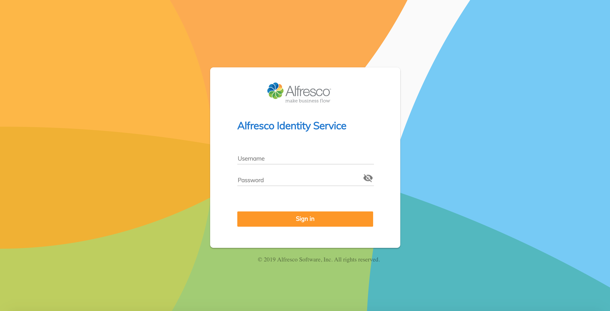

# Alfresco Identity Service (POC)

Provides a universal docker image that can be used across different setups.

Based on the [jboss/keycloak](https://hub.docker.com/r/jboss/keycloak) image,
all parameters and environment variables are supported.

Contents:

- **Dockerfile**
- **docker-compose.yml**
- **[alfresco keycloak theme](https://github.com/Alfresco/alfresco-keycloak-theme)**
- **alfresco-realm.json**

The realm file is already included into the image, but you can customise it
by providing external configuration file.



## Building image

```sh
npm run build
```

## Running container

```sh
npm start
```

Visit `http://localhost:8081` to see the instance up and running.
Visit `http://localhost:8081/auth/realms/alfresco/account` to check the theme.

## Running with docker-compose

```sh
docker-compose up
```

Visit `http://localhost:8081` to see the instance up and running.
Visit `http://localhost:8081/auth/realms/alfresco/account` to check the theme.

## Running from command line

```sh
docker run --rm -p 8081:8080 && \
    -e KEYCLOAK_USER=admin && \
    -e KEYCLOAK_PASSWORD=admin && \
    -e KEYCLOAK_IMPORT=/tmp/alfresco-realm.json && \
    alfresco/identity-service
```